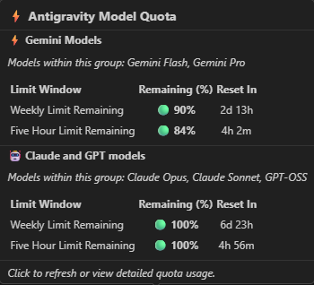

# Antigravity Model Quota Indicator Extension ⚡

A cross-platform VS Code / Antigravity IDE extension created by **decobeto** that displays AI model quota usage (**Gemini Models** and **Claude / GPT Models**), remaining percentages, and reset countdowns directly in the status bar.

---

## 🚀 Features

- **Real-time Quota Percentage**: Displays remaining quota percentages for 5-hour and weekly limits across all model groups (Gemini, Claude, GPT).
- **Reset Countdown**: Shows exact time remaining until quota refresh (e.g. `4h 26m` or `2d 13h`).
- **Zero Configuration (Auto-Discovery)**: Automatically discovers the running `language_server` background process, its active Connect RPC port, and CSRF authentication token on Windows, Linux, and macOS.
- **Rich Markdown Tooltip**: Hovering over the status bar item displays a detailed Markdown breakdown table with account email, limit windows, percentages, and reset times.
- **Interactive QuickPick Menu**: Clicking the status bar item opens a quick action menu with detailed quota limits and a manual refresh option.
- **Cross-Platform Support**: Works seamlessly out of the box on **Windows**, **Linux**, and **macOS**.

---

## 📸 Quota Breakdown Preview



```text
🛡️ Gemini: 91% (4h 26m) | Claude/GPT: 100%
```

---

## ⚙️ Configuration Options

Configure these settings in your `settings.json` or Extension Settings UI:

| Setting | Type | Default | Description |
| :--- | :---: | :---: | :--- |
| `antigravityQuota.refreshInterval` | `number` | `60` | Auto-refresh interval in seconds (set to `0` to disable). |
| `antigravityQuota.showModelName` | `boolean` | `true` | Show model group labels (Gemini / Claude) in the status bar. |
| `antigravityQuota.showCountdown` | `boolean` | `true` | Show reset countdown (e.g. `4h 26m`) in the status bar. |

---

## 🎮 Registered Commands

- `Antigravity Quota: Refresh Quotas Now` (`antigravityQuota.refresh`)
- `Antigravity Quota: Show Quota Details` (`antigravityQuota.showDetails`)

---

## 🛠️ How to Install in Antigravity IDE

### Option 1: Direct Extension Folder Copy (Recommended)
Copy this extension directory to your IDE extension path:
- **Windows**: `C:\Users\<YourUser>\.antigravity-ide\extensions\antigravity-quota-status`
- **Linux / macOS**: `~/.antigravity-ide/extensions/antigravity-quota-status`

Then reload your IDE window (`Ctrl+Shift+P` -> `Developer: Reload Window`).

### Option 2: Install via `.vsix` Package
1. Open Antigravity IDE.
2. Open the Extensions sidebar (`Ctrl+Shift+X`).
3. Click the `...` menu in the top right of the Extensions view.
4. Click **Install from VSIX...** and select `antigravity-quota-status-1.0.1.vsix`.

---

## ⚡ How It Works Under the Hood

The extension connects to the internal Antigravity Language Server RPC endpoint:
- **Endpoint**: `/exa.language_server_pb.LanguageServerService/RetrieveUserQuotaSummary`
- **Protocol**: Connect RPC / HTTP JSON POST
- **Authentication**: `x-codeium-csrf-token` header parsed dynamically from the active `language_server` process arguments.
